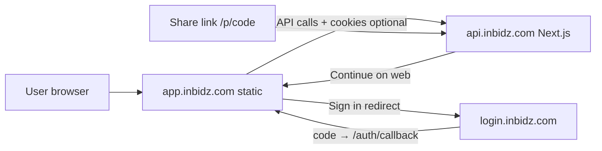

# Deploy public web app (`app.inbidz.com`)

Guide to ship the **Expo Router web** build as the Phase 1 public web surface. This is the same app as iOS/Android (`apps/mobile`), exported as a **static site** — not a separate marketing site.

**Related:** [Staging & app links](./staging-and-app-links.md) · [Project status](./project-status.md)

---

## What gets deployed where

| Domain | Service | Repo |
|--------|---------|------|
| **`app.inbidz.com`** | Public web app (feed, create, profile, buy/bid on web) | `apps/mobile` → static export |
| **`api.inbidz.com`** | API, Razorpay checkout pages, share OG at `/p/{code}` | `apps/api` (Next.js) |
| **`login.inbidz.com`** | Central auth (OAuth, token exchange) | External (`inbidz-com` / login app) |

**Staging equivalents**

| Production | Staging |
|------------|---------|
| `app.inbidz.com` | `staging.inbidz.com` |
| `api.inbidz.com` | `staging-api.inbidz.com` |
| `login.inbidz.com` | `staging-login.inbidz.com` |

Share links and WhatsApp previews stay on the **API** host (`SHORT_URL_BASE` → `https://api.inbidz.com/p/...`). The web app does not host `/p/{code}`; the API OG page links users to **Open in app** or **Continue on web** (`APP_PUBLIC_URL`).



---

## Prerequisites (deploy API + auth first)

The web app will not work in production until these are live:

1. **API** at `api.inbidz.com` (or staging-api) with production env — see `apps/api/.env.staging.example` and mirror for prod.
2. **MySQL** migrated (`npm run migrate` against prod DB).
3. **Central login** at `login.inbidz.com` with:
   - Same `JWT_SECRET` as the API (token verification).
   - **Allowed redirect / return URLs** for the web callback (see below).
4. **DNS** for `app.inbidz.com` pointing at your static host (Vercel, Cloudflare Pages, etc.).

---

## Build the static web app

From the monorepo root:

```bash
npm install
npm run build --workspace=@inbidz/shared
```

### Production build

```bash
cd apps/mobile

# Use the npm script (clears .expo cache — required after LAN dev)
npm run export:web:production
```

Or manually:

```bash
cd apps/mobile

export APP_ENV=production
export EXPO_PUBLIC_API_URL=https://api.inbidz.com
export EXPO_PUBLIC_AUTH_LOGIN_URL=https://id.inbidz.com/login

# Important: delete stale Expo cache from `expo start --lan` (bakes LAN IP into manifest)
rm -rf dist .expo
npx expo export --platform web --clear
```

Artifacts: **`apps/mobile/dist/`** (HTML, JS, assets). Upload the **contents of `dist/`** to your static host.

**Verify before upload** (must show production hosts, not `192.168.x` or `172.x`):

```bash
strings dist/_expo/static/js/web/*.js | grep -o '"apiUrl":"[^"]*"' | head -1
# Expected: "apiUrl":"https://api.inbidz.com"
```

### Staging build

```bash
export APP_ENV=staging
export EXPO_PUBLIC_API_URL=https://staging-api.inbidz.com
export EXPO_PUBLIC_AUTH_LOGIN_URL=https://staging-login.inbidz.com/login

npx expo export --platform web
```

Deploy `dist/` to **`staging.inbidz.com`**.

### Build-time config notes

| Variable | Purpose |
|----------|---------|
| `APP_ENV` | Picks URLs in `app.config.ts` (`production` / `staging` / `development`) |
| `EXPO_PUBLIC_API_URL` | Baked into client; must match live API |
| `EXPO_PUBLIC_AUTH_LOGIN_URL` | Login page URL (include `/login` path) |

`app.json` already sets `web.output: "static"` and Metro bundler — suitable for CDN/static hosting.

**Optional:** add a root script later, e.g. `npm run export:web:production`, wrapping the commands above.

---

## Hosting options

Any static host that supports **SPA fallback** (all routes → `index.html`) works.

### Option A — Vercel (recommended)

1. Import the repo; set **Root Directory** to `apps/mobile`.
2. **Build command:**

   ```bash
   cd ../.. && npm run build --workspace=@inbidz/shared && cd apps/mobile && npx expo export --platform web
   ```

3. **Output directory:** `dist`
4. **Environment variables** (Production):

   ```
   APP_ENV=production
   EXPO_PUBLIC_API_URL=https://api.inbidz.com
   EXPO_PUBLIC_AUTH_LOGIN_URL=https://login.inbidz.com/login
   ```

5. **Domains:** add `app.inbidz.com` (and `staging.inbidz.com` on a Preview/Staging project).

Vercel usually applies SPA rewrites for Expo static export automatically. If deep links 404, add a `vercel.json` in `apps/mobile`:

```json
{
  "rewrites": [{ "source": "/(.*)", "destination": "/index.html" }]
}
```

### Option B — Cloudflare Pages

- Build command: same as Vercel  
- Build output directory: `dist`  
- **Single-page app:** enable “SPA mode” or add `_redirects`:

  ```
  /*    /index.html   200
  ```

### Option C — Netlify

- Publish directory: `apps/mobile/dist`  
- `public/_redirects` or `netlify.toml`:

  ```toml
  [[redirects]]
    from = "/*"
    to = "/index.html"
    status = 200
  ```

### Option D — S3 + CloudFront

- Sync `dist/` to bucket  
- CloudFront **custom error response**: 403/404 → `/index.html` with 200  
- ACM certificate for `app.inbidz.com`

---

## API & login configuration (required)

### 1. API `APP_PUBLIC_URL`

On the **API** host env (not only the mobile build):

```bash
# Production
APP_PUBLIC_URL=https://app.inbidz.com
API_PUBLIC_URL=https://api.inbidz.com
AUTH_LOGIN_APP_URL=https://login.inbidz.com
SHORT_URL_BASE=https://api.inbidz.com/p
```

Used for:

- CORS (`apps/api/middleware.ts`) — browser requests from `app.inbidz.com` must be allowed  
- OG page “Continue on web” link (`apps/api/app/p/[code]/page.tsx`)  
- Default auth callback fallback in API routes  

**Redeploy API** after changing `APP_PUBLIC_URL`.

### 2. CORS check

`middleware.ts` allows origins in `APP_PUBLIC_URL` plus localhost/LAN. After deploy:

```bash
curl -sI -X OPTIONS \
  -H "Origin: https://app.inbidz.com" \
  -H "Access-Control-Request-Method: POST" \
  https://api.inbidz.com/api/posts
```

Expect `Access-Control-Allow-Origin: https://app.inbidz.com` and `Access-Control-Allow-Credentials: true`.

### 3. Central login allowlist

The login app must accept redirects back to the web app:

| Environment | Callback URL |
|-------------|----------------|
| Production | `https://app.inbidz.com/auth/callback` |
| Staging | `https://staging.inbidz.com/auth/callback` |

Mobile native builds use `inbidz://auth/callback` — configure those separately on the login app.

Web sign-in flow:

1. User taps Sign in → redirect to `login.inbidz.com/login?return_url=...`  
2. Login redirects to `https://app.inbidz.com/auth/callback?code=...`  
3. App exchanges code via `POST https://api.inbidz.com/auth/callback`  
4. Tokens stored in **localStorage** (web); API calls use **Bearer** + `credentials: include`  

Ensure `JWT_SECRET` matches between login token issuance and API verification.

---

## DNS

| Record | Name | Target |
|--------|------|--------|
| CNAME or A | `app` | Vercel / Cloudflare Pages / Netlify |
| (existing) | `api` | API deployment |
| (existing) | `login` | Login app |

Use **HTTPS** everywhere (required for secure cookies, OAuth, and Razorpay).

---

## Post-deploy checklist

### Web app (`app.inbidz.com`)

- [ ] `https://app.inbidz.com` loads feed (or sign-in)
- [ ] Sign in completes and returns to `/(tabs)` (no stuck spinner on `/auth/callback`)
- [ ] Feed loads posts from `api.inbidz.com`
- [ ] Create post (with shop setup) works for a test seller account
- [ ] Post detail: bid / buy / offer (as applicable)
- [ ] Profile tab shows user after login; refresh after ~15 min still works (token refresh)
- [ ] Direct URL works: `https://app.inbidz.com/post/{id}` (SPA rewrite)
- [ ] Desktop layout: wide shell; mobile width: centered column

### Cross-service

- [ ] API health: `GET https://api.inbidz.com/api/health`
- [ ] Share link: `https://api.inbidz.com/p/{code}` shows OG + “Continue on web” → `app.inbidz.com`
- [ ] Razorpay buy on web opens checkout on API host and returns successfully
- [ ] `APP_PUBLIC_URL` on API equals deployed web origin (no typo `http` vs `https`)

### Staging dry run

- [ ] Repeat checklist on `staging.inbidz.com` + `staging-api.inbidz.com` before switching production DNS

---

## CI/CD sketch (GitHub Actions)

Run on tag or `main` when `apps/mobile/**` changes:

```yaml
name: Deploy web app
on:
  push:
    branches: [main]
    paths: ['apps/mobile/**', 'packages/shared/**']

jobs:
  export:
    runs-on: ubuntu-latest
    steps:
      - uses: actions/checkout@v4
      - uses: actions/setup-node@v4
        with:
          node-version: '20'
          cache: npm
      - run: npm ci
      - run: npm run build --workspace=@inbidz/shared
      - working-directory: apps/mobile
        env:
          APP_ENV: production
          EXPO_PUBLIC_API_URL: https://api.inbidz.com
          EXPO_PUBLIC_AUTH_LOGIN_URL: https://login.inbidz.com/login
        run: npx expo export --platform web
      # Upload apps/mobile/dist to your host (Vercel action, AWS CLI, etc.)
```

Wire the upload step to your provider (Vercel Git integration is often simpler than manual upload).

---

## Web vs native (expectations)

| Feature | Web (`app.inbidz.com`) | Native app |
|---------|------------------------|------------|
| Feed, create, profile, post detail | Yes | Yes |
| Sign in | Browser redirect to login | In-app browser / deep link |
| Buy Now | Razorpay via API checkout page (full redirect) | In-app browser checkout |
| Share short links | Copy / Web Share API | Native share sheet |
| Universal Links | N/A (use API `/p/{code}` in browser) | iOS/Android app links |
| Push notifications | Not implemented | Phase 3 |
| Video | `expo-av` (deprecated warning) | Same |

---

## Troubleshooting

| Symptom | Likely cause | Fix |
|---------|----------------|-----|
| API calls fail with CORS | `APP_PUBLIC_URL` not set or wrong on API | Set to `https://app.inbidz.com`, redeploy API |
| Sign-in redirect fails | Login app missing callback URL | Allowlist `https://app.inbidz.com/auth/callback` |
| `Unauthorized` on buy/bid | Expired token | Refresh flow runs on profile focus / commerce actions; sign in again |
| 404 on refresh of `/post/xyz` | No SPA fallback | Add rewrite to `index.html` |
| Blank page after deploy | Wrong output path | Publish **`dist/`** contents, not repo root |
| Wrong API in prod | Stale build env | Re-export with `npm run export:web:production` |
| Redirects to LAN IP (`192.168.x` / `172.x`) | Stale `.expo` cache from `expo start --lan` | `rm -rf apps/mobile/.expo dist` then `npm run export:web:production` |
| OG link opens wrong site | `APP_PUBLIC_URL` on API | Must point to web app, not API host |

---

## Production env quick reference

**API** (`api.inbidz.com`) — copy from `.env.example` / `.env.staging.example` and set:

```bash
APP_PUBLIC_URL=https://app.inbidz.com
API_PUBLIC_URL=https://api.inbidz.com
AUTH_LOGIN_APP_URL=https://login.inbidz.com
SHORT_URL_BASE=https://api.inbidz.com/p
JWT_SECRET=<same as login app>
# + DB, R2, Razorpay, APPLE_TEAM_ID, ANDROID_SHA256_FINGERPRINT when ready
```

**Web build** (`app.inbidz.com`):

```bash
APP_ENV=production
EXPO_PUBLIC_API_URL=https://api.inbidz.com
EXPO_PUBLIC_AUTH_LOGIN_URL=https://login.inbidz.com/login
```

**Login app** — allow return URLs:

- `https://app.inbidz.com/auth/callback`
- `inbidz://auth/callback` (native)

---

## Completing Phase 1

Once `app.inbidz.com` passes the post-deploy checklist and share links point “Continue on web” to it, the plan item **“Web app live at app.inbidz.com”** is done. Update [project-status.md](./project-status.md) when you have verified production.

**Suggested order**

1. Deploy **staging** web → `staging.inbidz.com`  
2. Set API `APP_PUBLIC_URL` + login allowlist for staging  
3. Run staging checklist  
4. Deploy **production** web → `app.inbidz.com`  
5. Run production checklist  
