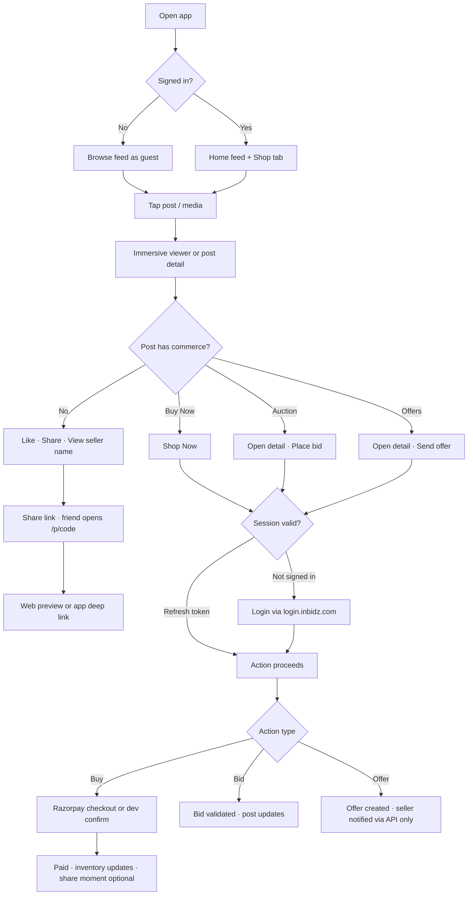
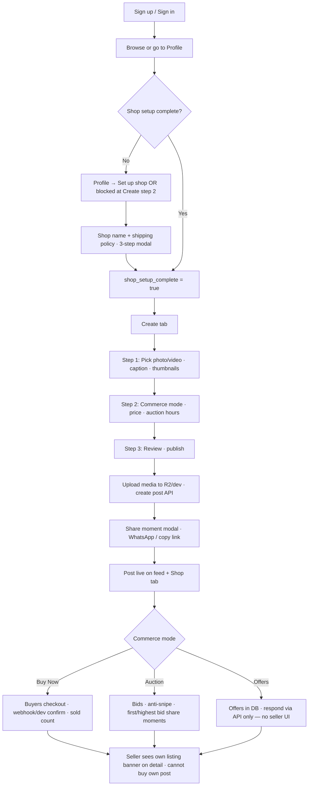

# INBIDZ App — Project Status

Status snapshot against the [INBIDZ Social Commerce App plan](/Users/wagish/.cursor/plans/inbidz_social_commerce_app_af6fbcb9.plan.md).  
**Last updated:** June 2026 · Monorepo: `apps/mobile`, `apps/api`, `packages/shared`

---

## Plan todos (from plan file)

| Plan item | Status | Notes |
|-----------|--------|-------|
| Monorepo scaffold (Expo + Next.js API + shared) | **Done** | Workspaces, scripts, typecheck |
| Central auth (login.inbidz.com + deep links) | **Done** | JWT exchange, refresh, mobile + web callback |
| MySQL schema (posts, commerce, bids, offers, orders) | **Done** | `001_initial_schema.sql`, `002_media_thumbnails.sql` |
| Feed + post detail (photo/video, portrait/landscape) | **Done** | Adaptive media, immersive viewer, explore/shop tab |
| Commerce MVP (shop setup, buy, auction, offers) | **Mostly done** | Core API + mobile detail screen; gaps below |
| Viral sharing (moments, short URLs, OG) | **Mostly done** | Share modal, `/p/{code}`, OG page; rich OG images partial |
| Dual-sided onboarding | **Partial** | Shop setup + sell banner; no full buyer/seller wizard polish |

---

## What’s done

### Platform & auth
- Monorepo with Expo SDK 54 mobile, Next.js API, shared Zod/types
- Sign in via `login.inbidz.com` (OAuth code → JWT in SecureStore)
- Token refresh on app start, profile tab focus, and before buy/bid/offer
- Deep link scheme `inbidz://` + auth callback route
- Profile sync into `app_profiles` on login

### Posts & media
- Create flow: photo, video, carousel; caption; commerce toggle
- Portrait/landscape-aware layout in feed and detail
- Video: lazy load in feed, pause on tab switch, poster thumbnails on upload
- Immersive full-screen viewer (Reels-style) with vertical swipe between posts
- R2 upload (+ dev fallback for local); multipart upload from mobile
- Shop setup gate before publishing commerce posts

### Feed & discovery
- Home feed: posts, pull-to-refresh, like (bookmark), sell nudge from onboarding API
- Shop/Explore tab: commerce posts, “ending soon” sort for auctions
- Post detail screen with commerce actions
- Profile tab (cached user, refresh on focus)

### Commerce
- Per-post modes: `none`, `buy_now`, `auction`, `offers`, `buy_now_and_offers`
- **Buy Now:** order creation, Razorpay hosted checkout (in-app browser), payment confirm + webhook, dev test payments when Razorpay unset
- **Auction:** place bid with starting-price floor, min increment, anti-snipe extension; bid list API
- **Offers:** create offer on post; accept/decline/counter API (creates Razorpay order on accept)
- Inventory / sold count updates on paid orders
- Share moments on first bid, highest bid, first sale, buyer purchase, post live

### Sharing & growth
- Short URLs (`/p/{code}`) with referrer attribution header on buy
- Web OG landing page + “Open in app” component
- Apple/Android app-link route stubs (`.well-known`)
- Share sheet / WhatsApp message from mobile
- Staging config: `eas.json`, `app.config.ts`, env examples, staging doc

### API surface (implemented)
Posts, like, bid, buy, offers, offer respond, orders (checkout/confirm/dev), Razorpay webhook, auth/me, auth callback, upload (presign/r2/dev), share, shop setup, onboarding, follow, invite apply, share-image (SVG), health.

---

## What’s left (by plan phase)

### Phase 1 gaps (foundation)
| Item | Status |
|------|--------|
| Follow sellers (UI) | **Done** — `FollowButton`, `POST /api/follow`, profile header |
| Other users’ profiles / seller grid | **Done** — `GET /api/users/[id]`, `app/user/[id]`, 3-col grid |
| User’s own posts on profile | **Done** — profile tab stats + `ProfilePostGrid` |
| Comments | **Done** — `post_comments` table, API, post detail section |
| Algorithmic / followed-seller feed | **Done** — For you / Following tabs, discover ranking |
| Public web app at `app.inbidz.com` | Mobile web works; deploy guide ready → [deploy-web-app.md](./deploy-web-app.md) |

### Phase 2 gaps (commerce core)
| Item | Status |
|------|--------|
| Shipping address on checkout | API schema exists; no mobile form |
| Native Razorpay SDK | Web checkout only |
| Auction end → winner checkout window | Not built |
| Seller dashboard (views, sales, orders) | Not built |
| In-app notifications (bid outbid, offer received) | Not built |
| Order fulfillment (shipped/delivered) | DB fields only |
| Payout / KYC integration | `payout_ready` stub only |
| Offer accept/counter UI for seller/buyer | API only |

### Phase 3 gaps (social loop)
| Item | Status |
|------|--------|
| DM / messages inbox | DB tables exist; no API routes or UI |
| Push notifications (Expo Notifications) | Not built |
| Ambassador / invite UI | Referral code on profile; apply API only |
| Share moments: “ending in 10 min”, first like prompts | Partial (some moment types in share service) |
| TestFlight / Play internal testing | EAS config exists; not fully wired in repo |

### Phase 4 gaps (growth + polish)
| Item | Status |
|------|--------|
| HLS / video transcoding (Cloudflare Stream) | Documented; `hls_url` never set |
| Real-time bids (WebSocket) | Polling/manual refresh only |
| Collections / drops, challenges, co-sign posts | Not built |
| Deferred deep links (Branch/Firebase) | Not built |
| Rich dynamic OG images (post photo composite) | SVG template only |
| Universal Links fully live | Needs `APPLE_TEAM_ID`, Android fingerprint, production builds |
| App Store / Play Store launch | Not started |
| Feed cold-start seeding / import from inbidz.org | Not built |

### Known polish / bugs addressed in recent work
- Token refresh before commerce actions (reduces intermittent Unauthorized)
- First bid minimum = seller’s starting price (not just ₹100 increment)
- Keyboard UX on bid screen (scroll, Done accessory)
- Video upload via `uploadAsync` (fixes 0-byte iOS uploads)
- MySQL datetime format for auction fields on create

### Still partial / tech debt
- `expo-av` deprecated → migrate to `expo-video` / `expo-audio`
- Immersive viewer: Shop Now works; bid/offer requires opening post detail
- Logout clears local tokens only (no central revoke)
- Migration runner has no version table (re-run risk)
- LAN dev: OG links and universal links don’t work until public HTTPS + real build

---

## User journeys (current app behavior)

### Buyer journey

**Step-by-step (buyer):**

1. **Discover** — Open app → Home (all posts) or Shop tab (commerce only). No login required to scroll.
2. **View** — Tap media → immersive full-screen viewer; swipe vertically between posts; tap bag/View for detail.
3. **Sign in (when needed)** — Like, buy, bid, or offer triggers login → browser → `login.inbidz.com` → returns to app with tokens.
4. **Buy Now** — Shop Now (immersive or detail) → order created → Razorpay sheet (or dev test confirm) → success alert → post may show sold state.
5. **Auction** — Post detail → enter bid ≥ starting price (or current + increment) → Place bid → high bid updates on screen.
6. **Offer** — Post detail → amount + optional message → Send offer → alert only (no inbox yet to track response).
7. **Share** — Share icon → link in message → recipient hits API `/p/{code}` (web preview) or app route `/p/[code]` → immersive post.
8. **After purchase** — Share moment can fire for buyer; referral code visible on own profile only.

---

### Seller journey

**Step-by-step (seller):**

1. **Account** — Sign in via central auth; profile created/synced automatically.
2. **Shop setup** — Required before commerce on create: name (+ optional shipping policy) via Profile or `/shop/setup` modal.
3. **Create post** — Create tab → media (multi-select carousel) → commerce mode:
   - **View only** — no commerce block
   - **Buy Now** — price (+ inventory for buy_now modes)
   - **Auction** — price as starting bid, duration in hours, auto start/end
   - **Buy Now + offers** — price + auction-style timing for hybrid
4. **Publish** — Media uploads (R2 or dev); video poster generated; post appears on feed.
5. **Share on publish** — Share moment modal with short URL and pre-filled WhatsApp text (skippable).
6. **Manage listing** — View on feed; open detail shows “This is your listing” (no self-bid/buy).
7. **Receive activity** — Bids update `current_bid`; orders mark paid via Razorpay; share moments created server-side.
8. **Gaps for seller today** — No dashboard, no offer inbox, no accept/counter UI, no auction winner flow, no payout onboarding UI.

---

## Phase mapping (plan vs reality)

| Plan phase | Target | Current state |
|------------|--------|---------------|
| **Phase 1** Foundation | Feed, auth, profiles, explore, short URLs | **~95%** — social graph, comments, feed modes done |
| **Phase 2** Commerce core | Buy, auction, orders, notifications | **~70%** — buy/bid/offer create work; settlement, dashboard, notify missing |
| **Phase 3** Social loop | DM offers, push, ambassador, store testing | **~25%** — offer API only; no messaging UI or push |
| **Phase 4** Growth | Algorithm, HLS, realtime, store launch | **~10%** — docs and config started |

---

## Suggested next priorities (not in plan file)

1. Messages / offer inbox + seller accept/counter UI  
2. Auction end job + winner payment window  
3. Follow button + seller profile with post grid  
4. Push notifications for bid/offer/sale  
5. Universal links on staging/production EAS builds  
6. `expo-video` migration + optional HLS pipeline  

---

## Related docs

- [Staging and app links](./staging-and-app-links.md)
- [Video playback and optimization](./video-playback-and-optimization.md)
- [README](../README.md)
